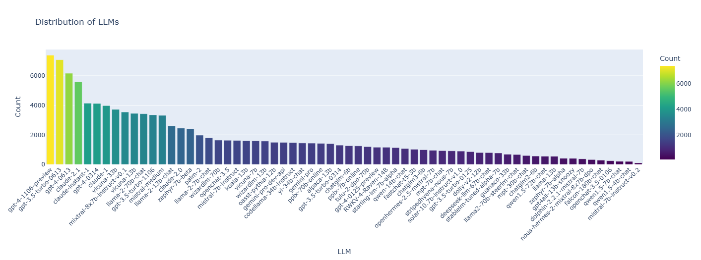
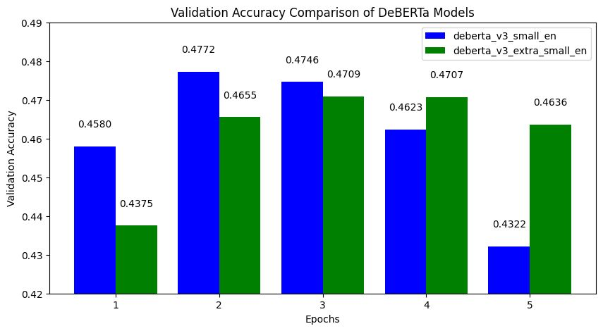
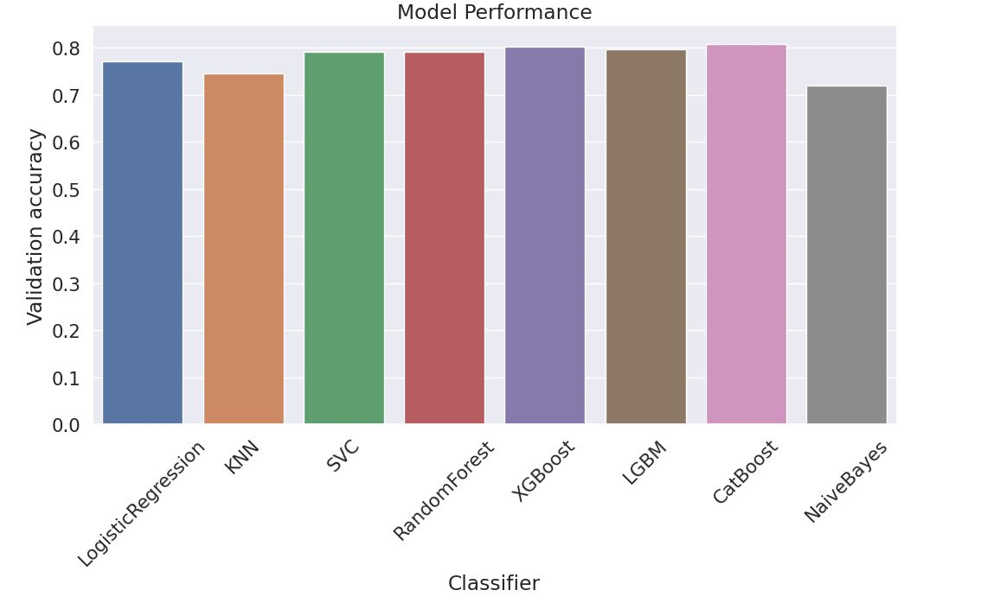

# AI Engineer

#### Technical Skills: Python, C++, React, AWS

## Education
- B.Eng. in Artificial Intelligence – Systems & Technologies | The Chinese University of Hong Kong (_Sept 2019 - July 2023_)	

## Projects
### [Predicting user choices based on real-world LLM chatbot conversations](https://github.com/JeffereyWu-AI/LLM-Classification-Finetuning-Kaggle) 
_Users interact with two anonymous LLMs and select their preferred response. The goal is to build a model that predicts which response a user will favor, enhancing AI's ability to generate human-aligned outputs._
- **Model** – Fine-tuned DeBERTa V3 to compare response embeddings.
- **Training Data** – Preprocessed real chatbot conversations.
- **Optimization** – Used JAX-based Keras backend for efficient training on GPU.
- **Evaluation** – Monitored log loss & categorical accuracy, ensuring stable performance.

### [Spaceship Titanic: Predicting Passenger Fate with Machine Learning](https://github.com/JeffereyWu-AI/Spaceship-Titanic-Kaggle) 
_A Kaggle competition that required predicting which passengers were transported to an alternate dimension._
- **Exploratory Data Analysis (EDA)** – Uncovered patterns in missing values, passenger demographics, and spending habits on the spaceship.
- **Feature Engineering** – Engineered new features such as family grouping, cabin location, and spending behavior to enhance model performance.
- **Model Selection & Optimization** – Implemented and fine-tuned powerful classifiers, including XGBoost, LightGBM, and CatBoost, using Stratified K-Fold Cross-Validation.
- **Threshold Tuning for Class Imbalance** – Optimized classification thresholds to align predicted probabilities with real-world class distribution.

