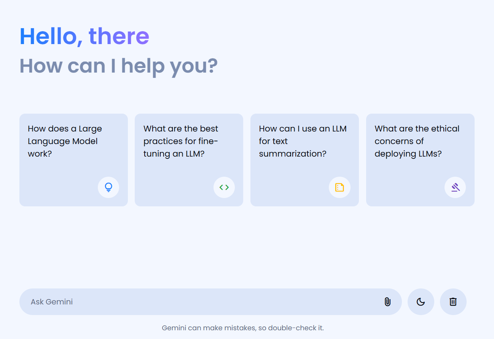
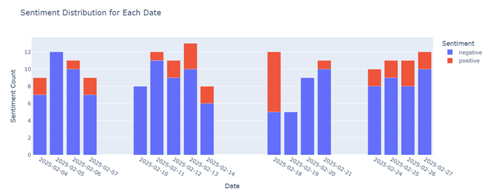
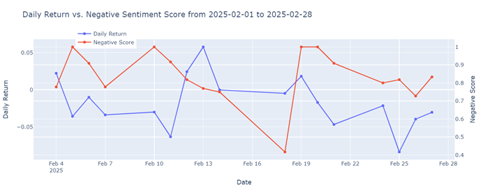

# AI Engineer

#### Technical Skills: Python, C++, React, AWS, LLM, Web Scraping

## Education
- B.Eng. in Artificial Intelligence – Systems & Technologies | The Chinese University of Hong Kong (_Sept 2019 - July 2023_)	

## Projects
### [Building an LLM AI Chatbot with Google Gemini API](https://github.com/JeffereyWu-AI/gemini-ai-chatbot) 
_A lightweight and interactive AI chatbot powered by Google Gemini API and built with Vanilla JavaScript. This project enables intelligent conversations with an LLM model while providing a smooth user experience with a modern UI._
- **Large Language Model (LLM) Integration** – Powered by Google Gemini API (gemini-1.5-flash) for natural and contextual responses.
- **Typing Effect Simulation** – Creates a more human-like chat experience.
- **File Upload Support** – Users can share images and files for a richer interaction.
- **Light/Dark Mode** – Customizable UI for better accessibility.

### [Build an AI Stock Sentiment Analyzer with Google Gemini](https://github.com/JeffereyWu-AI/BlueSkySentimentAnalysis) 
_I built an AI-powered stock sentiment analyzer using Gemini-1.5 to explore how social media sentiment influences stock performance. Here’s how I did it:_
- **Data Collection** – I gathered historical stock price data via yfinance and scraped posts mentioning specific stocks from Bluesky.
- **AI-Powered Sentiment Analysis** – Using Gemini-1.5, I classified posts as positive, negative, or neutral and determined if they explicitly discussed a company’s stock performance.
- **Data Visualization & Insights** – Negative sentiment often correlated with stock declines. Market reactions showed a lag effect. Investors took time to respond to sentiment shifts.
- **Prompt**:
Analyze the following post and determine:
1. Whether it is related to the company, {search_term}, and relates to or discusses past, current, or future stock performance of {search_term} explicitly.
2. If related, classify the sentiment as positive, negative, or neutral.
Post: "{content}"
_I used "Tesla Inc" as an example._

### [Predicting user choices based on real-world LLM chatbot conversations](https://github.com/JeffereyWu-AI/LLM-Classification-Finetuning-Kaggle) 
_Users interact with two anonymous LLMs and select their preferred response. The goal is to build a model that predicts which response a user will favor, enhancing AI's ability to generate human-aligned outputs._
- **Model** – Fine-tuned DeBERTa V3 to compare response embeddings.
- **Training Data** – Preprocessed real chatbot conversations.
- **Optimization** – Used JAX-based Keras backend for efficient training on GPU.
- **Evaluation** – Monitored log loss & categorical accuracy, ensuring stable performance.

### [Spaceship Titanic: Predicting Passenger Fate with Machine Learning](https://github.com/JeffereyWu-AI/Spaceship-Titanic-Kaggle) 
_A Kaggle competition that required predicting which passengers were transported to an alternate dimension._
- **Exploratory Data Analysis (EDA)** – Uncovered patterns in missing values, passenger demographics, and spending habits on the spaceship.
- **Feature Engineering** – Engineered new features such as family grouping, cabin location, and spending behavior to enhance model performance.
- **Model Selection & Optimization** – Implemented and fine-tuned powerful classifiers, including XGBoost, LightGBM, and CatBoost, using Stratified K-Fold Cross-Validation.
- **Threshold Tuning for Class Imbalance** – Optimized classification thresholds to align predicted probabilities with real-world class distribution.

